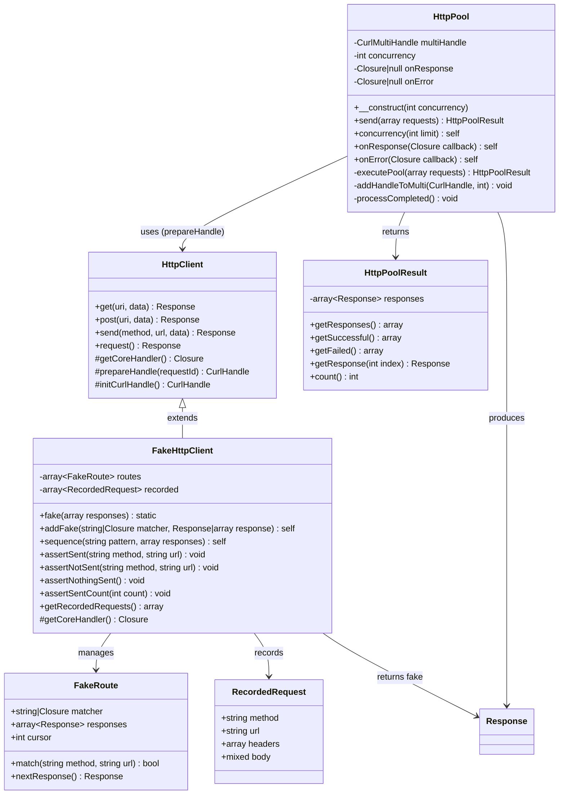
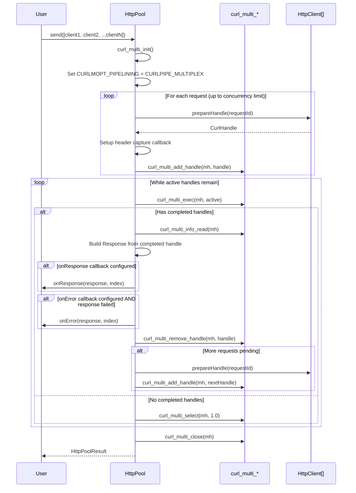
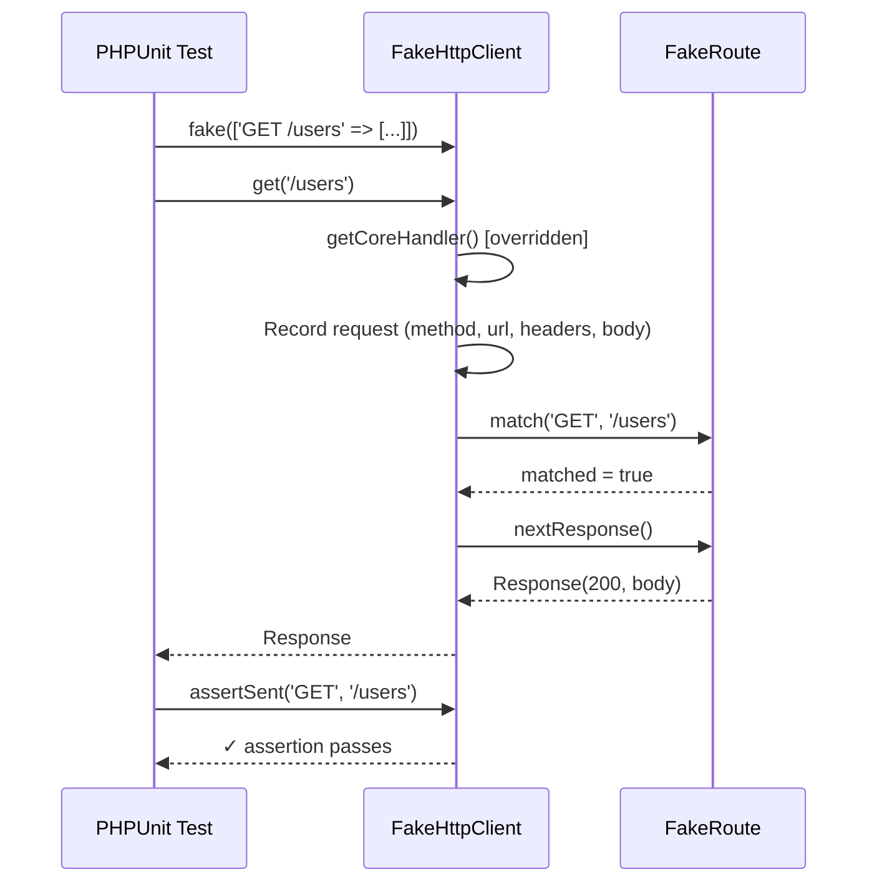

# Design Document: HttpPool & Testing

## Overview

This design introduces three cohesive features to the Simsoft HttpClient
library:

1. **HttpPool** — A companion class for concurrent HTTP request execution via
   `curl_multi_*`, with HTTP/2 multiplexing, configurable concurrency limits,
   and per-response callbacks.
2. **Connection Pooling** — Transparent cURL handle reuse within HttpClient via
   `curl_reset()` instead of `curl_init()` per request (already partially
   implemented in `CurlOptionsTrait::initCurlHandle()`).
3. **FakeHttpClient** — A built-in test double extending HttpClient that
   intercepts request execution to return predefined responses, with request
   recording and PHPUnit assertion integration.

All three features maintain zero external runtime dependencies, full backward
compatibility, and follow the library's existing trait-composition and
fluent-API patterns.

## Architecture

### Class Relationship Diagram



### HttpPool Execution Sequence



### FakeHttpClient Override Flow



## Components and Interfaces

### HttpPool

**Location:** `src/HttpPool.php`

HttpPool is a standalone companion class (not extending HttpClient). It accepts
an array of pre-configured HttpClient instances or closures that return
HttpClient instances, extracts their prepared cURL handles, and executes them
concurrently via `curl_multi_*`.

```php
namespace Simsoft\HttpClient;

class HttpPool
{
    /** @var int Maximum concurrent requests. */
    private int $concurrency = 25;

    /** @var Closure|null Per-response callback: fn(Response, int): void */
    private ?Closure $onResponse = null;

    /** @var Closure|null Error callback: fn(Response, int): void */
    private ?Closure $onError = null;

    /**
     * Create a new HttpPool instance.
     *
     * @param int $concurrency Maximum concurrent requests (default: 25).
     */
    public function __construct(int $concurrency = 25);

    /**
     * Set the concurrency limit.
     *
     * @param int $limit Maximum simultaneous requests.
     * @return $this
     */
    public function concurrency(int $limit): self;

    /**
     * Register a per-response callback.
     *
     * @param Closure(Response, int): void $callback
     * @return $this
     */
    public function onResponse(Closure $callback): self;

    /**
     * Register an error callback.
     *
     * @param Closure(Response, int): void $callback
     * @return $this
     */
    public function onError(Closure $callback): self;

    /**
     * Execute all requests concurrently.
     *
     * @param array<int, HttpClient|Closure(): HttpClient> $requests
     * @return HttpPoolResult
     */
    public function send(array $requests): HttpPoolResult;
}
```

**Key Design Decisions:**

1. **Access to prepareHandle()**: HttpPool needs to call `prepareHandle()` on
   each HttpClient instance. Since `prepareHandle()` is `private` in
   `PrepareHandleTrait`, we will change its visibility to `protected` so
   HttpPool can access it via a thin internal method. Alternatively, we
   introduce a `public` method `buildHandle(): CurlHandle` on HttpClient that
   wraps the prepare logic specifically for pool usage. The latter approach is
   cleaner — it avoids exposing internal trait methods and gives HttpPool a
   stable contract.

2. **No inheritance**: HttpPool does NOT extend HttpClient. It composes with
   HttpClient instances.

3. **Sliding window**: Requests are added to the multi handle up to the
   concurrency limit. As each completes, the next pending request is added —
   maintaining maximum throughput without exceeding the limit.

4. **Header capture**: Each handle gets its own `CURLOPT_HEADERFUNCTION`
   callback to capture response headers independently.

### HttpPoolResult

**Location:** `src/HttpPoolResult.php`

A simple value object wrapping the results array with convenience methods.

```php
namespace Simsoft\HttpClient;

class HttpPoolResult implements Countable
{
    /**
     * @param array<int, Response> $responses Indexed responses matching input order.
     */
    public function __construct(private array $responses);

    /** @return array<int, Response> All responses. */
    public function getResponses(): array;

    /** @return array<int, Response> Only successful (2xx) responses. */
    public function getSuccessful(): array;

    /** @return array<int, Response> Only failed responses (4xx, 5xx, network errors). */
    public function getFailed(): array;

    /** @return Response Response at the given index. */
    public function getResponse(int $index): Response;

    /** @return int Total number of responses. */
    public function count(): int;
}
```

### FakeHttpClient

**Location:** `src/Testing/FakeHttpClient.php`

FakeHttpClient extends HttpClient and overrides `getCoreHandler()` to intercept
request execution. This is the minimal override point — all fluent
configuration (headers, body, URL) still works normally, but instead of
executing cURL, the fake returns a predefined Response.

```php
namespace Simsoft\HttpClient\Testing;

use Simsoft\HttpClient\HttpClient;
use Simsoft\HttpClient\Response;

class FakeHttpClient extends HttpClient
{
    /** @var array<int, FakeRoute> Configured fake routes. */
    private array $routes = [];

    /** @var array<int, RecordedRequest> Recorded requests. */
    private array $recorded = [];

    /**
     * Static factory with pre-configured responses.
     *
     * @param array<string, mixed> $responses Map of "METHOD URL" => response config.
     * @return static
     */
    public static function fake(array $responses = []): static;

    /**
     * Add a fake response for a pattern.
     *
     * @param string|Closure $matcher URL pattern (supports * wildcard) or callable.
     * @param Response|array|int $response Response object, config array, or status code.
     * @return $this
     */
    public function addFake(string|Closure $matcher, Response|array|int $response): self;

    /**
     * Add a sequence of responses for a pattern.
     *
     * @param string $pattern URL pattern.
     * @param array<int, Response|array|int> $responses Ordered responses.
     * @return $this
     */
    public function sequence(string $pattern, array $responses): self;

    /**
     * Assert a request was sent matching method and URL.
     *
     * @param string $method HTTP method.
     * @param string $url URL or pattern.
     * @return void
     * @throws \PHPUnit\Framework\AssertionFailedError
     */
    public function assertSent(string $method, string $url): void;

    /**
     * Assert a request was NOT sent.
     *
     * @param string $method HTTP method.
     * @param string $url URL or pattern.
     * @return void
     */
    public function assertNotSent(string $method, string $url): void;

    /**
     * Assert no requests were made.
     *
     * @return void
     */
    public function assertNothingSent(): void;

    /**
     * Assert the total number of requests made.
     *
     * @param int $count Expected count.
     * @return void
     */
    public function assertSentCount(int $count): void;

    /**
     * Get all recorded requests.
     *
     * @return array<int, RecordedRequest>
     */
    public function getRecordedRequests(): array;

    /**
     * Override: returns fake responses instead of executing cURL.
     *
     * @return Closure
     */
    protected function getCoreHandler(): Closure;
}
```

### FakeRoute

**Location:** `src/Testing/FakeRoute.php`

Internal value object managing a single fake route's matcher and response
sequence.

```php
namespace Simsoft\HttpClient\Testing;

class FakeRoute
{
    /** @var string|Closure URL pattern or callable matcher. */
    private string|Closure $matcher;

    /** @var array<int, Response> Response sequence. */
    private array $responses;

    /** @var int Current position in the sequence. */
    private int $cursor = 0;

    public function match(string $method, string $url): bool;
    public function nextResponse(): Response;
}
```

### RecordedRequest

**Location:** `src/Testing/RecordedRequest.php`

Simple DTO capturing request details for assertion.

```php
namespace Simsoft\HttpClient\Testing;

class RecordedRequest
{
    public function __construct(
        public readonly string $method,
        public readonly string $url,
        public readonly array $headers,
        public readonly mixed $body,
    );
}
```

### Connection Pooling (Enhancement to existing CurlOptionsTrait)

Connection pooling is **already partially implemented**. The current
`initCurlHandle()` method in `CurlOptionsTrait` already reuses the handle:

```php
protected function initCurlHandle(): CurlHandle
{
    if ($this->curlHandle !== null) {
        curl_reset($this->curlHandle);
        return $this->curlHandle;
    }
    $this->curlHandle = curl_init();
    // ...
    return $this->curlHandle;
}
```

This means sequential requests on the same HttpClient instance already reuse the
handle. The design validates this behavior is correct and documents it. No
additional code changes are needed for connection pooling — it's already working
as specified in Requirements 6 and 7.

### HttpClient::buildHandle() — Pool Integration Point

A new `public` method on HttpClient that HttpPool calls to get a prepared cURL
handle:

```php
/**
 * Build a prepared cURL handle for external execution (used by HttpPool).
 *
 * This method prepares the handle with all configured options but does NOT
 * execute it. The caller is responsible for execution and cleanup.
 *
 * @return CurlHandle The prepared handle ready for curl_multi_add_handle().
 */
public function buildHandle(): CurlHandle
{
    $requestId = uniqid('httpclient_req_', true);
    return $this->prepareHandle($requestId);
}
```

This keeps `prepareHandle()` private while giving HttpPool a stable public
contract.

## Data Models

### HttpPool Internal State

```
HttpPool:
  concurrency: int (default 25, min 1)
  onResponse: ?Closure(Response, int): void
  onError: ?Closure(Response, int): void

During execution (transient):
  multiHandle: CurlMultiHandle
  activeHandles: array<int, CurlHandle>  (index => handle)
  handleToIndex: SplObjectStorage<CurlHandle, int>
  headerBuffers: array<int, string>  (index => raw headers)
  pendingQueue: array<int, HttpClient|Closure>  (remaining requests)
  results: array<int, Response>  (completed responses)
```

### FakeHttpClient Internal State

```
FakeHttpClient:
  routes: array<int, FakeRoute>
  recorded: array<int, RecordedRequest>

FakeRoute:
  matcher: string|Closure
    - String format: "METHOD URL_PATTERN" (e.g., "GET /api/users/*")
    - String format: "URL_PATTERN" (any method, e.g., "/api/*")
    - Closure format: fn(string $method, string $url, array $headers, mixed $body): bool
  responses: array<int, Response>
  cursor: int (current position, clamped to last index)

RecordedRequest:
  method: string (e.g., "GET", "POST")
  url: string (full URL including base)
  headers: array<string, array<string>> (normalized headers)
  body: mixed (post fields as configured)
```

### Pattern Matching Rules

URL patterns support:

- **Exact match**: `"GET https://api.example.com/users"` — matches only this
  exact URL
- **Wildcard**: `"GET https://api.example.com/users/*"` — `*` matches any path
  segment(s)
- **Method-agnostic**: `"https://api.example.com/users"` — matches any HTTP
  method
- **Callable**:
  `fn($method, $url, $headers, $body) => str_contains($url, '/users')` — full
  control

### Response Factory (for FakeHttpClient)

Fake responses can be configured as:

- `Response` object — used directly
- `int` — creates a Response with that status code and empty body
- `array` with keys:
    - `status` (int, default 200)
    - `headers` (array, default [])
    - `body` (string, default '')

## Correctness Properties

*A property is a characteristic or behavior that should hold true across all
valid executions of a system — essentially, a formal statement about what the
system should do. Properties serve as the bridge between human-readable
specifications and machine-verifiable correctness guarantees.*

### Property 1: Pool Count Invariant

*For any* array of N request configurations (where N ≥ 1), `HttpPool::send()`
SHALL return an `HttpPoolResult` containing exactly N Response objects,
regardless of individual request success or failure.

**Validates: Requirements 1.1, 4.1, 4.2, 5.2**

### Property 2: Pool Order Preservation

*For any* array of N requests submitted to HttpPool, the returned results array
SHALL maintain the same index mapping as the input — the Response at index `i`
in the result corresponds to the request at index `i` in the input, regardless
of the order in which requests actually complete.

**Validates: Requirements 1.2**

### Property 3: Pool Concurrency Limit

*For any* concurrency limit C (where C ≥ 1) and any batch of N requests (where
N ≥ 1), the number of simultaneously active cURL handles in the multi handle
SHALL never exceed `min(C, N)` at any point during execution.

**Validates: Requirements 1.3**

### Property 4: Pool Failure Isolation

*For any* batch of N requests where K requests fail (with network errors or HTTP
error statuses, where 0 ≤ K ≤ N), all remaining N-K requests SHALL complete
successfully and their Response objects SHALL be present in the results array at
their original indices.

**Validates: Requirements 4.1, 4.2**

### Property 5: Pool Result Partitioning

*For any* `HttpPoolResult` containing N responses, `getSuccessful()` and
`getFailed()` SHALL form a complete partition — every response appears in
exactly one of the two sets, `getSuccessful()` contains only responses where
`successful()` is true, `getFailed()` contains only responses where `failed()`
is true, and their combined count equals N.

**Validates: Requirements 4.3, 4.4**

### Property 6: Pool Callback Invocation

*For any* batch of N requests with an `onResponse` callback configured, the
callback SHALL be invoked exactly N times — once per response with its correct
index. Additionally, if an `onError` callback is configured, it SHALL be invoked
exactly for those responses where `failed()` returns true, and the count of
error callback invocations SHALL equal the count of failed responses.

**Validates: Requirements 5.1, 5.3**

### Property 7: Handle Reuse Invariant

*For any* sequence of M requests (where M ≥ 2) executed on the same HttpClient
instance, the `curlHandle` property SHALL reference the same CurlHandle object
after the first initialization — `curl_init()` is called at most once, and
subsequent requests use `curl_reset()` on the existing handle.

**Validates: Requirements 6.1, 6.2**

### Property 8: Fake Pattern Matching

*For any* URL pattern P configured in FakeHttpClient and any request URL U, the
matcher SHALL return true if and only if U matches P according to the matching
rules (exact match, wildcard expansion, method prefix, or callable evaluation).
When a match occurs, the configured Response SHALL be returned.

**Validates: Requirements 8.2, 8.4**

### Property 9: Fake Unmatched Request Exception

*For any* request URL U that does not match any configured pattern in
FakeHttpClient, executing that request SHALL throw an exception. The set of URLs
that throw is exactly the complement of the set that matches any configured
pattern.

**Validates: Requirements 8.3**

### Property 10: Fake Response Construction

*For any* valid combination of status code S (100-599), headers map H, and body
string B, a fake Response constructed from these values SHALL expose
`getStatusCode() === S`, `getHeaders()` containing all entries from H, and
`body() === B`.

**Validates: Requirements 8.5**

### Property 11: Fake Request Recording

*For any* sequence of N requests made through FakeHttpClient (each with method
M_i, URL U_i, headers H_i, body B_i), `getRecordedRequests()` SHALL return an
array of exactly N RecordedRequest objects where each entry at index i has
`method === M_i`, `url === U_i`, `headers` containing H_i, and `body === B_i`.
Furthermore, `assertSent(M_i, U_i)` SHALL pass for all i, and
`assertSentCount(N)` SHALL pass.

**Validates: Requirements 9.1, 9.2, 9.3, 9.4**

### Property 12: Fake Response Sequencing

*For any* sequence of K responses configured for a URL pattern P, the first K
matching requests SHALL return responses in order (response[0],
response[1], ..., response[K-1]). For any subsequent matching request beyond K,
the response SHALL always be response[K-1] (the last in the sequence).

**Validates: Requirements 10.1, 10.2**

## Error Handling

### HttpPool Error Strategy

| Error Type                                       | Behavior                                         | Result                                                        |
|--------------------------------------------------|--------------------------------------------------|---------------------------------------------------------------|
| Network error (DNS, timeout, connection refused) | Continue executing remaining requests            | Response with `errno > 0`, `statusCode = 0` at original index |
| HTTP error (4xx, 5xx)                            | Continue executing remaining requests            | Response with error status at original index                  |
| Invalid input (non-HttpClient in array)          | Throw `InvalidArgumentException` immediately     | Pool does not execute                                         |
| Concurrency limit ≤ 0                            | Throw `InvalidArgumentException` on construction | Pool not created                                              |
| curl_multi_init() failure                        | Throw `RuntimeException`                         | Pool does not execute                                         |
| Closure throws exception                         | Catch, create error Response with errno          | Error Response at original index                              |

**Design Rationale:** Individual request failures never abort the batch. This
matches the user expectation for concurrent operations — you want all results,
even partial failures. The `HttpPoolResult::getFailed()` method provides easy
access to failures for retry logic.

### FakeHttpClient Error Strategy

| Error Type                           | Behavior                                                           |
|--------------------------------------|--------------------------------------------------------------------|
| No matching pattern for request      | Throw `UnexpectedRequestException` (extends `RuntimeException`)    |
| Invalid response configuration       | Throw `InvalidArgumentException` during `addFake()` / `sequence()` |
| Assertion failure (assertSent, etc.) | Throw `\PHPUnit\Framework\AssertionFailedError`                    |
| Empty routes configured              | First request throws `UnexpectedRequestException`                  |

### Connection Pooling Error Handling

No new error paths. The existing `initCurlHandle()` already throws
`RuntimeException` if `curl_init()` fails. Since handle reuse via `curl_reset()`
cannot fail (it's a void operation on a valid handle), no additional error
handling is needed.

## Testing Strategy

### Property-Based Testing (steos/quickcheck)

Property-based tests will use the existing `steos/quickcheck` library already in
`require-dev`. Each property test runs a minimum of 100 iterations.

**Tag format:**
`Feature: http-pool-and-testing, Property {number}: {property_text}`

#### Properties to Implement as PBT

| Property                        | Test Class                   | Generator Strategy                                                            |
|---------------------------------|------------------------------|-------------------------------------------------------------------------------|
| P1: Pool Count Invariant        | `HttpPoolPropertyTest`       | Gen::choose(1, 50) for batch size, FakeHttpClient instances                   |
| P2: Pool Order Preservation     | `HttpPoolPropertyTest`       | Gen::choose(1, 30) for batch size, unique identifiers per request             |
| P3: Pool Concurrency Limit      | `HttpPoolPropertyTest`       | Gen::choose(1, 10) for concurrency, Gen::choose(1, 30) for batch size         |
| P4: Pool Failure Isolation      | `HttpPoolPropertyTest`       | Gen::choose(1, 20) for batch size, Gen::elements for failure positions        |
| P5: Pool Result Partitioning    | `HttpPoolResultPropertyTest` | Gen::choose(1, 50) for count, Gen::elements for status codes                  |
| P6: Pool Callback Invocation    | `HttpPoolPropertyTest`       | Gen::choose(1, 20) for batch size, mixed success/failure                      |
| P7: Handle Reuse Invariant      | `ConnectionPoolPropertyTest` | Gen::choose(2, 20) for request count                                          |
| P8: Fake Pattern Matching       | `FakeHttpClientPropertyTest` | Gen::asciiStrings for URLs, Gen::elements for pattern types                   |
| P9: Fake Unmatched Exception    | `FakeHttpClientPropertyTest` | Gen::asciiStrings for non-matching URLs                                       |
| P10: Fake Response Construction | `FakeHttpClientPropertyTest` | Gen::choose(100, 599) for status, Gen::asciiStrings for body                  |
| P11: Fake Request Recording     | `FakeHttpClientPropertyTest` | Gen::choose(1, 20) for request count, Gen::elements for methods               |
| P12: Fake Response Sequencing   | `FakeHttpClientPropertyTest` | Gen::choose(1, 10) for sequence length, Gen::choose(1, 20) for total requests |

### Unit Tests (PHPUnit)

Unit tests cover specific examples, edge cases, and integration points:

**HttpPool:**

- Default concurrency is 25
- Empty request array returns empty result
- Single request works (degenerate case)
- Closure-based request creation
- `buildHandle()` returns valid CurlHandle

**HttpPoolResult:**

- Empty result (zero responses)
- All successful
- All failed
- Mixed results
- `getResponse()` with invalid index throws exception

**FakeHttpClient:**

- `fake()` static factory creates instance
- Exact URL matching
- Wildcard pattern matching (`*` segments)
- Method + URL matching (`"GET /users"`)
- Callable matcher
- `assertNothingSent()` on fresh instance
- `assertNothingSent()` fails after request
- PHPUnit assertion exceptions on failure
- Response from array config (status, headers, body)
- Response from integer (status code only)
- Mixing sequenced and single responses

**Connection Pooling:**

- Handle is reused across sequential requests (reflection check)
- `__destruct()` closes the handle
- No new public methods exposed

### Test File Organization

```
tests/
├── HttpPoolPropertyTest.php
├── HttpPoolResultPropertyTest.php
├── HttpPoolTest.php
├── ConnectionPoolPropertyTest.php
├── Testing/
│   ├── FakeHttpClientPropertyTest.php
│   └── FakeHttpClientTest.php
```

### Performance Benchmarks (Manual / CI)

Not part of the automated test suite, but documented for validation:

- 100 concurrent requests: HttpPool vs Guzzle Pool (wall time + peak memory)
- Sequential handle reuse: 50 requests with reuse vs 50 with fresh handles (
  latency comparison)
- HTTP/2 multiplexing: 20 requests to same host with/without multiplexing

### Testing Dependencies

- `phpunit/phpunit` ^11 (existing)
- `steos/quickcheck` ^2.0 (existing)
- No new test dependencies required
