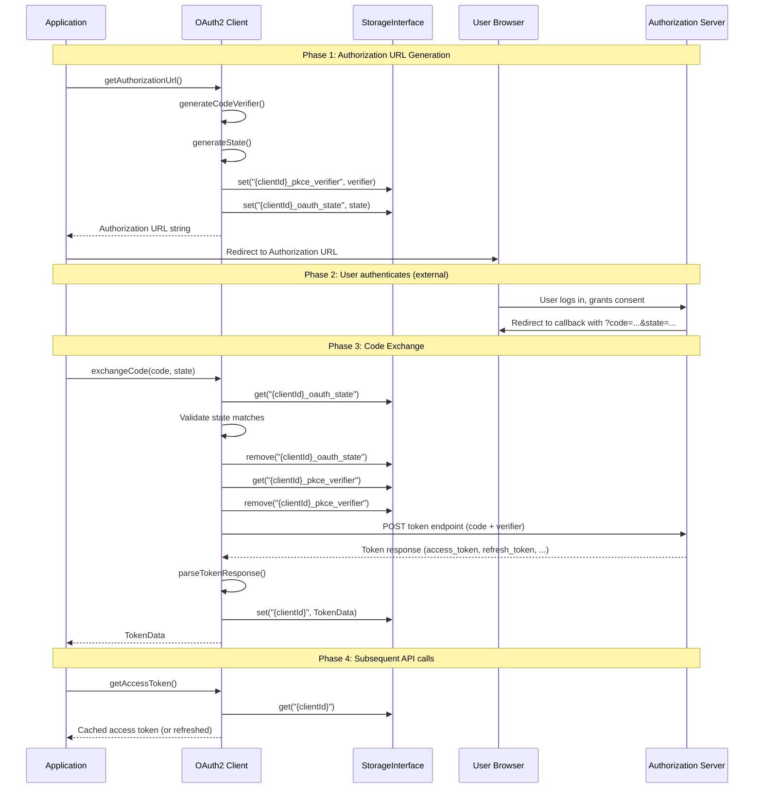
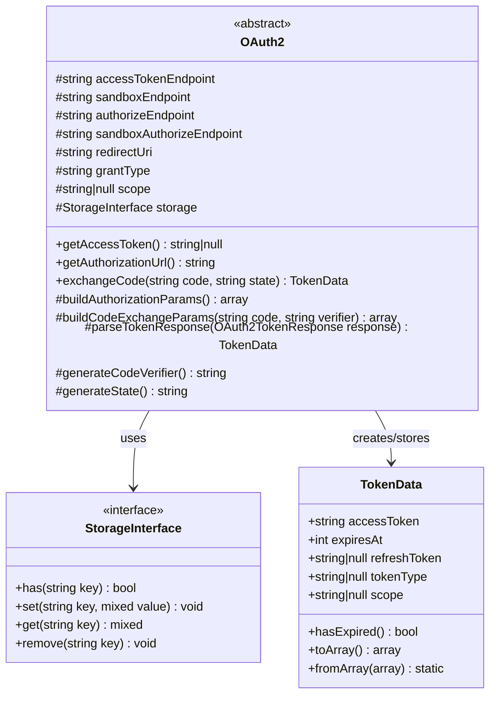

# Design Document: OAuth2 Authorization Code Flow with PKCE

## Overview

This design extends the existing abstract `OAuth2` class with Authorization Code
Flow + PKCE support. Rather than creating a new class, we add new public
methods (`getAuthorizationUrl()`, `exchangeCode()`) and protected extension
points to the existing `OAuth2` class. This approach preserves full backward
compatibility — the existing `client_credentials` flow via `getAccessToken()`
remains unchanged, while the new methods enable the interactive browser-redirect
flow.

The authorization code flow requires two HTTP round-trips separated by a user
interaction:

1. **Redirect phase**: Generate an authorization URL and redirect the user to
   the provider's login page.
2. **Callback phase**: Receive the authorization code at the redirect URI,
   validate state, and exchange the code for tokens.

PKCE (Proof Key for Code Exchange, RFC 7636) is applied automatically to protect
against authorization code interception. The `state` parameter provides CSRF
protection.

### Key Design Decisions

| Decision                            | Choice                                     | Rationale                                                                                                                                                              |
|-------------------------------------|--------------------------------------------|------------------------------------------------------------------------------------------------------------------------------------------------------------------------|
| Extend existing class vs. new class | Extend existing `OAuth2`                   | Tokens from auth code flow reuse the same `TokenData` + `StorageInterface` + `getAccessToken()` caching/refresh logic. Avoids duplication.                             |
| PKCE/state storage                  | Same `StorageInterface`, prefixed keys     | Reuses existing infrastructure. Keys like `{clientId}_pkce_verifier` and `{clientId}_oauth_state` avoid collision with the token key (`{clientId}`).                   |
| PKCE enabled by default             | Always-on for auth code flow               | RFC 7636 recommends PKCE for all public and confidential clients. No opt-out needed.                                                                                   |
| Provider extensibility              | Protected methods with array-merge pattern | Subclasses override `buildAuthorizationParams()`, `buildCodeExchangeParams()`, or `parseTokenResponse()` to add/modify parameters. Base implementation merges results. |
| Code verifier length                | 128 characters                             | Maximum allowed by RFC 7636 (43–128 chars). Maximizes entropy.                                                                                                         |

## Architecture



### Class Hierarchy (unchanged)



## Components and Interfaces

### New Public Methods on `OAuth2`

#### `getAuthorizationUrl(): string`

Generates the full authorization URL for redirecting the user. Internally:

1. Validates that `$authorizeEndpoint` (or `$sandboxAuthorizeEndpoint` in
   sandbox mode) is configured.
2. Calls `generateCodeVerifier()` → stores via
   `$storage->set("{$clientId}_pkce_verifier", $verifier)`.
3. Calls `generateState()` → stores via
   `$storage->set("{$clientId}_oauth_state", $state)`.
4. Calls `buildAuthorizationParams()` to assemble the query parameters.
5. Filters out null values, URL-encodes, and appends as query string.

```php
public function getAuthorizationUrl(): string
```

#### `exchangeCode(string $code, string $state): TokenData`

Exchanges an authorization code for tokens. Internally:

1. Retrieves stored state, compares with `$state` parameter. Throws
   `RuntimeException` on mismatch.
2. Removes stored state (prevents replay).
3. Retrieves stored PKCE verifier, removes it from storage.
4. Calls `buildCodeExchangeParams($code, $verifier)` to assemble POST body.
5. Calls existing `buildTokenRequest($params)` to make the HTTP call.
6. Validates response success. Throws `RuntimeException` on failure.
7. Calls `parseTokenResponse($response)` to build `TokenData`.
8. Stores `TokenData` via `$storage->set($this->clientId, $tokenData)`.
9. Returns `TokenData`.

```php
public function exchangeCode(string $code, string $state): TokenData
```

### New Protected Properties

```php
/** @var string Authorization endpoint URL (production). */
protected string $authorizeEndpoint = '';

/** @var string Authorization endpoint URL (sandbox). */
protected string $sandboxAuthorizeEndpoint = '';

/** @var string OAuth2 redirect URI (callback URL). */
protected string $redirectUri = '';
```

### New Protected Extension Points

#### `buildAuthorizationParams(): array`

Returns the query parameters for the authorization URL. Subclasses override to
add provider-specific params (e.g., `access_type=offline`).

```php
protected function buildAuthorizationParams(string $state, string $codeChallenge): array
{
    $params = [
        'client_id' => $this->clientId,
        'redirect_uri' => $this->redirectUri,
        'response_type' => 'code',
        'state' => $state,
        'code_challenge' => $codeChallenge,
        'code_challenge_method' => 'S256',
    ];

    if ($this->scope !== null) {
        $params['scope'] = $this->scope;
    }

    return $params;
}
```

#### `buildCodeExchangeParams(string $code, string $verifier): array`

Returns the POST body parameters for the token exchange request. Subclasses
override to add/modify params.

```php
protected function buildCodeExchangeParams(string $code, string $verifier): array
{
    return [
        'grant_type' => 'authorization_code',
        'code' => $code,
        'redirect_uri' => $this->redirectUri,
        'client_id' => $this->clientId,
        'client_secret' => $this->clientSecret,
        'code_verifier' => $verifier,
    ];
}
```

#### `parseTokenResponse(OAuth2TokenResponse $response): TokenData`

Converts a token response into a `TokenData` object. Subclasses override to
handle non-standard response fields. Default implementation delegates to the
existing `toTokenData()` method.

```php
protected function parseTokenResponse(OAuth2TokenResponse $response): TokenData
{
    return $this->toTokenData($response);
}
```

### PKCE Generation (Private Helpers)

#### `generateCodeVerifier(): string`

Generates a 128-character random string from the unreserved character set (
`A-Z`, `a-z`, `0-9`, `-`, `.`, `_`, `~`) using `random_bytes()`.

```php
private function generateCodeVerifier(): string
{
    $unreserved = 'ABCDEFGHIJKLMNOPQRSTUVWXYZabcdefghijklmnopqrstuvwxyz0123456789-._~';
    $length = 128;
    $verifier = '';
    $bytes = random_bytes($length);

    for ($i = 0; $i < $length; $i++) {
        $verifier .= $unreserved[ord($bytes[$i]) % strlen($unreserved)];
    }

    return $verifier;
}
```

#### `generateCodeChallenge(string $verifier): string`

Derives the S256 code challenge from a verifier.

```php
private function generateCodeChallenge(string $verifier): string
{
    $hash = hash('sha256', $verifier, true);
    return rtrim(strtr(base64_encode($hash), '+/', '-_'), '=');
}
```

#### `generateState(): string`

Generates a 32-byte (64 hex characters) cryptographically random state value.

```php
private function generateState(): string
{
    return bin2hex(random_bytes(32));
}
```

### Storage Key Convention

| Key Pattern                | Purpose                  | Lifecycle                                            |
|----------------------------|--------------------------|------------------------------------------------------|
| `{clientId}`               | Token storage (existing) | Set on token acquisition, removed on explicit logout |
| `{clientId}_pkce_verifier` | PKCE code verifier       | Set before redirect, removed after code exchange     |
| `{clientId}_oauth_state`   | CSRF state value         | Set before redirect, removed after validation        |

### Authorization Endpoint Resolution

```php
private function getAuthorizeEndpoint(): string
{
    $endpoint = $this->sandboxMode
        ? $this->sandboxAuthorizeEndpoint
        : $this->authorizeEndpoint;

    if ($endpoint === '') {
        throw new RuntimeException(
            'Authorization endpoint not configured. Set $authorizeEndpoint in your OAuth2 subclass.'
        );
    }

    return $endpoint;
}
```

## Data Models

### TokenData (unchanged)

The existing `TokenData` value object is reused without modification. Tokens
obtained via the authorization code flow are stored identically to those from
`client_credentials`:

```php
final class TokenData
{
    public function __construct(
        public readonly string  $accessToken,
        public readonly int     $expiresAt,
        public readonly ?string $refreshToken = null,
        public readonly ?string $tokenType = null,
        public readonly ?string $scope = null,
    ) {}
}
```

### Authorization URL Parameters (transient)

Not a persisted model — assembled in memory and serialized to a URL query
string:

| Parameter               | Type         | Source                |
|-------------------------|--------------|-----------------------|
| `client_id`             | string       | `$this->clientId`     |
| `redirect_uri`          | string       | `$this->redirectUri`  |
| `response_type`         | string       | Always `"code"`       |
| `scope`                 | string\|null | `$this->scope`        |
| `state`                 | string       | Generated, stored     |
| `code_challenge`        | string       | Derived from verifier |
| `code_challenge_method` | string       | Always `"S256"`       |

### Code Exchange Parameters (transient)

POST body for the token endpoint:

| Parameter       | Type   | Source                        |
|-----------------|--------|-------------------------------|
| `grant_type`    | string | Always `"authorization_code"` |
| `code`          | string | From callback query string    |
| `redirect_uri`  | string | `$this->redirectUri`          |
| `client_id`     | string | `$this->clientId`             |
| `client_secret` | string | `$this->clientSecret`         |
| `code_verifier` | string | Retrieved from storage        |

## Correctness Properties

*A property is a characteristic or behavior that should hold true across all
valid executions of a system — essentially, a formal statement about what the
system should do. Properties serve as the bridge between human-readable
specifications and machine-verifiable correctness guarantees.*

### Property 1: Authorization URL contains all required parameters

*For any* valid OAuth2 configuration (non-empty clientId, redirectUri,
authorizeEndpoint, and optional scope), the generated authorization URL SHALL
contain `client_id`, `redirect_uri`, `response_type=code`, `state`,
`code_challenge`, and `code_challenge_method=S256` parameters; and SHALL include
`scope` if and only if scope is configured as non-null.

**Validates: Requirements 1.1, 1.2, 1.3, 1.4, 2.3**

### Property 2: URL parameter encoding round-trip

*For any* string value used as a parameter in the authorization URL,
URL-decoding the parameter value from the generated URL SHALL produce the
original string value.

**Validates: Requirements 1.5**

### Property 3: Code verifier format invariant

*For any* generated code verifier, the verifier SHALL be exactly 128 characters
long and SHALL contain only characters from the unreserved set (A-Z, a-z, 0-9,
`-`, `.`, `_`, `~`).

**Validates: Requirements 2.1**

### Property 4: PKCE challenge derivation round-trip

*For any* valid code verifier string, base64url-decoding the derived code
challenge SHALL produce a byte sequence equal to the SHA-256 hash of the
original verifier.

**Validates: Requirements 2.2, 2.6**

### Property 5: URL generation stores verifier and state

*For any* call to `getAuthorizationUrl()`, the StorageInterface SHALL contain
both a PKCE verifier (at key `{clientId}_pkce_verifier`) and a state value (at
key `{clientId}_oauth_state`) after the method returns.

**Validates: Requirements 2.5, 3.1, 3.2**

### Property 6: State mismatch prevents exchange

*For any* two distinct strings used as stored state and provided state, calling
`exchangeCode()` with the non-matching state SHALL throw a RuntimeException and
SHALL NOT make any HTTP request to the token endpoint.

**Validates: Requirements 3.3, 3.4, 4.1**

### Property 7: Code exchange request contains all required parameters

*For any* valid authorization code and stored PKCE verifier, the token exchange
POST request SHALL contain `grant_type=authorization_code`, `code`,
`redirect_uri`, `client_id`, `client_secret`, and `code_verifier` parameters
with their correct values.

**Validates: Requirements 2.4, 4.2**

### Property 8: Successful exchange stores TokenData

*For any* successful token endpoint response containing an access_token,
expires_in, and optional refresh_token, `exchangeCode()` SHALL store a TokenData
instance in the StorageInterface (keyed by clientId) with matching accessToken
and refreshToken values.

**Validates: Requirements 4.3, 4.6**

### Property 9: Failed exchange throws RuntimeException

*For any* non-successful HTTP response (status code >= 400) from the token
endpoint, `exchangeCode()` SHALL throw a RuntimeException whose message contains
the HTTP status code.

**Validates: Requirements 4.4**

### Property 10: State is removed after successful exchange

*For any* successful code exchange, the state key (`{clientId}_oauth_state`)
SHALL no longer exist in the StorageInterface after `exchangeCode()` returns.

**Validates: Requirements 3.5**

### Property 11: Subclass authorization params appear in URL

*For any* provider subclass that overrides `buildAuthorizationParams()` to add
custom key-value pairs, the generated authorization URL SHALL contain those
custom parameters in addition to the standard parameters.

**Validates: Requirements 6.1, 6.4**

### Property 12: Subclass exchange params appear in request

*For any* provider subclass that overrides `buildCodeExchangeParams()` to add
custom key-value pairs, the token exchange POST request SHALL contain those
custom parameters in addition to the standard parameters.

**Validates: Requirements 6.2**

### Property 13: Subclass parseTokenResponse override is used

*For any* provider subclass that overrides `parseTokenResponse()` to return a
modified TokenData, the stored TokenData after `exchangeCode()` SHALL reflect
the modifications made by the override.

**Validates: Requirements 6.3, 6.5**

## Error Handling

### Error Scenarios

| Scenario                     | Method                  | Behavior                                                          |
|------------------------------|-------------------------|-------------------------------------------------------------------|
| Missing `$authorizeEndpoint` | `getAuthorizationUrl()` | Throws `RuntimeException` with descriptive message                |
| State mismatch (CSRF)        | `exchangeCode()`        | Throws `RuntimeException` indicating CSRF failure                 |
| Missing stored state         | `exchangeCode()`        | Throws `RuntimeException` (no state to compare)                   |
| Missing stored verifier      | `exchangeCode()`        | Throws `RuntimeException` (cannot complete PKCE)                  |
| Token endpoint HTTP error    | `exchangeCode()`        | Throws `RuntimeException` with HTTP status code and error message |
| Token refresh failure        | `getAccessToken()`      | Returns `null`, logs error (existing behavior)                    |

### Error Design Principles

1. **Fail fast on security violations**: State mismatch throws immediately,
   before any HTTP call.
2. **Explicit exceptions for developer errors**: Missing configuration throws
   `RuntimeException` with actionable messages.
3. **Graceful degradation for runtime failures**: `getAccessToken()` returns
   `null` on refresh failure (existing pattern), allowing the application to
   handle re-authentication.
4. **No silent re-authentication**: When an auth-code token expires and refresh
   fails, the library does NOT silently redirect the user. The application must
   explicitly call `getAuthorizationUrl()` again.

### Exception Messages

```php
// Missing authorize endpoint
"Authorization endpoint not configured. Set \$authorizeEndpoint in your OAuth2 subclass."

// CSRF state mismatch
"State parameter mismatch: possible CSRF attack. Expected stored state does not match callback state."

// Missing stored state
"No stored state found for client \"{clientId}\". The authorization flow may have expired or was not initiated."

// Missing stored verifier
"No stored PKCE verifier found for client \"{clientId}\". The authorization flow may have expired or was not initiated."

// Token endpoint error
"Code exchange failed [HTTP {statusCode}]: {errorMessage}"
```

## Testing Strategy

### Property-Based Testing (steos/quickcheck)

The feature is well-suited for property-based testing because:

- URL generation is a pure transformation (config → URL string) with a large
  input space
- PKCE generation involves cryptographic operations with verifiable mathematical
  properties
- State validation is a universal security invariant
- Parameter propagation must hold for all possible values

**Library**: `steos/quickcheck` ^2.0 (already in dev dependencies)
**Minimum iterations**: 100 per property test
**Tag format**: `Feature: oauth2-auth-code-flow, Property {N}: {title}`

Each correctness property (1–13) maps to a single property-based test method.
Tests use the existing `InMemoryStorage` helper and a test subclass of `OAuth2`
that overrides `buildTokenRequest()` to capture parameters without making real
HTTP calls.

### Unit Tests (PHPUnit)

Unit tests cover specific examples, edge cases, and integration points:

| Test                                         | Type       | Coverage     |
|----------------------------------------------|------------|--------------|
| Missing authorize endpoint throws            | Edge case  | Req 8.3      |
| Sandbox mode uses sandbox authorize endpoint | Example    | Req 8.4      |
| client_credentials flow unaffected           | Regression | Req 7.1, 7.4 |
| Refresh failure returns null (no re-auth)    | Example    | Req 5.2      |
| State removed after failed exchange too      | Edge case  | Cleanup      |
| PKCE verifier removed after exchange         | Edge case  | Cleanup      |

### Test File Organization

```
tests/Clients/
├── OAuth2AuthCodePropertyTest.php   # Property-based tests (Properties 1-13)
├── OAuth2AuthCodeTest.php           # Unit tests (examples, edge cases)
├── OAuth2PropertyTest.php           # Existing PBT (unchanged)
└── OAuth2Test.php                   # Existing unit tests (unchanged)
```

### Test Subclass Design

A `AuthCodeTestOAuth2` subclass will:

- Set `$authorizeEndpoint` and `$redirectUri` to test values
- Override `buildTokenRequest()` to capture params and return mock responses
- Expose `generateCodeVerifier()` and `generateState()` via public wrapper
  methods for direct testing
- Track request count to verify no-call scenarios

For extensibility tests (Properties 11–13), additional subclasses will override
the protected extension points with configurable behavior.
