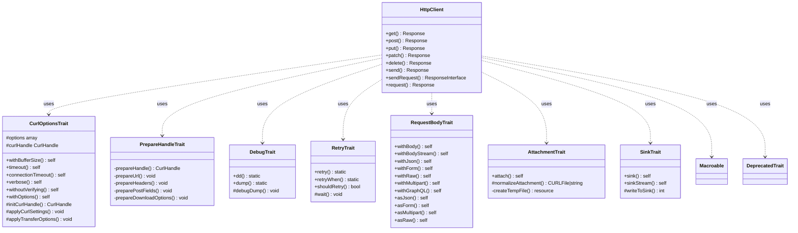

# Design Document: PHPMD Compliance Fixes

## Overview

This design describes the refactoring strategy to eliminate all PHPMD violations
from the `simsoft/http-client` library while preserving full backward
compatibility (186 tests, PHPStan level 8, identical public API).

The current `src/HttpClient.php` is 1272 lines with 20+ fields, 30+ methods,
and high coupling. Several traits (`DebugTrait`, `CurlOptionsTrait`,
`PrepareHandleTrait`) already exist but the main class still contains duplicated
logic and violations. The `Response.php` class already uses `@SuppressWarnings`
annotations for its intentional method count (HTTP status helpers).

The refactoring follows a **trait extraction + in-place cleanup** strategy:
extract cohesive method groups into new traits, eliminate `else` expressions via
early returns, rename short variables, add targeted `@SuppressWarnings`
annotations for intentionally short names (`to()`, `dd()`, `ok()`), and
decompose complex methods.

## Architecture

The existing architecture uses trait composition to decompose `HttpClient` into
focused concerns. This refactoring extends that pattern by extracting additional
method groups into new traits and cleaning up the remaining code in-place.

### Refactoring Strategy

The refactoring is organized into three categories:

1. **Trait Extraction** — Move cohesive method groups out of `HttpClient` into
   new traits to reduce class size, field count, method count, and coupling.
2. **Complexity Reduction** — Decompose complex methods, eliminate `else`
   expressions, and simplify control flow.
3. **Naming & Annotation Fixes** — Rename short variables, add
   `@SuppressWarnings` for intentionally short method names, and suppress
   unused parameter warnings on cURL callback signatures.

### New Traits to Create

| Trait              | Methods Extracted                                                                                                                           | Fields Moved                                      | Purpose                  |
|--------------------|---------------------------------------------------------------------------------------------------------------------------------------------|---------------------------------------------------|--------------------------|
| `RequestBodyTrait` | `withBody`, `withBodyStream`, `withJson`, `withForm`, `withRaw`, `withMultipart`, `withGraphQL`, `asJson`, `asForm`, `asMultipart`, `asRaw` | `$postFields`, `$postFieldsOwned`, `$contentType` | Request body preparation |
| `AttachmentTrait`  | `attach`, `normalizeAttachment`, `createTempFile`                                                                                           | `$hasAttachments`, `$tmpFiles`                    | File attachment handling |
| `SinkTrait`        | `sink` (split into `sink` + `sinkStream`), `writeToSink`                                                                                    | `$sink`, `$sinkPath`, `$sinkOwned`                | Download/sink management |

### Existing Traits to Activate

`RetryTrait` already exists at `src/Traits/RetryTrait.php` with the retry
methods extracted. The `HttpClient` class currently still has duplicate
retry/wait/shouldRetry methods that must be removed in favor of the trait.

`PrepareHandleTrait` already exists with the decomposed `prepareHandle()` logic.
The `HttpClient` class currently still has the monolithic `prepareHandle()` that
must be removed in favor of the trait.

## Components and Interfaces

### RequestBodyTrait

Extracts all request body preparation methods. Moves `$postFields`,
`$postFieldsOwned`, and `$contentType` fields. The content type constants
(`TYPE_JSON`, `TYPE_FORM`, `TYPE_MULTIPART`, `TYPE_RAW`) remain on `HttpClient`
since they are public API constants.

### AttachmentTrait

Extracts `attach()`, `normalizeAttachment()`, and `createTempFile()`. Moves
`$hasAttachments` and `$tmpFiles` fields. The `normalizeAttachment()` method
will be refactored to reduce cyclomatic complexity by extracting helper methods
for each file type (resource, file path, raw string).

Key decomposition of `normalizeAttachment()`:

- `normalizeResourceAttachment()` — handles `is_resource()` case
- `normalizeFilePathAttachment()` — handles file path string case
- `normalizeRawStringAttachment()` — handles raw string case

### SinkTrait

Extracts sink/download functionality. The `sink()` method's boolean
`$streamOnly` parameter is replaced by two distinct methods:

- `sink(mixed $destination)` — file-based download (CURLOPT_FILE)
- `sinkStream(mixed $destination)` — stream-based download (
  CURLOPT_WRITEFUNCTION)

This eliminates the `BooleanArgumentFlag` violation while providing a clearer
API. The old `sink($dest, true)` call becomes `sinkStream($dest)`.

### ElseExpression Elimination

All `else`/`elseif` blocks across the codebase are replaced with early returns
or guard clauses:

- `HttpClient::flush()` — replace `elseif` chain with sequential `if` + early
  processing
- `HttpClient::sink()` — replace `elseif` with guard clause
- `CurlOptionsTrait::applyTransferOptions()` — already clean
- `PrepareHandleTrait` — replace any remaining `else` blocks with early returns
- `Response::setHeaders()` — already uses `continue` pattern

### Short Variable Renaming

The `$v` variable in `HttpClient::withHeader()` lambda `fn($v) => (string)$v`
is renamed to `$val` (minimum 2 characters per PHPMD rule, 3 per project
convention).

### PHPMD Suppression Annotations

For intentionally short names that are well-known conventions:

- `HttpClient::to()` — `@SuppressWarnings(PHPMD.ShortMethodName)` — fluent API
  convention
- `DebugTrait::dd()` — `@SuppressWarnings(PHPMD.ShortMethodName)` — dump-and-die
  convention
- `DebugTrait::debugDump()` — `@SuppressWarnings(PHPMD.ExitExpression)` —
  intentional exit behavior
- `Response::ok()` — already suppressed

### Unused Parameter Suppression

cURL callbacks require specific signatures mandated by the cURL API. Parameters
like `$ch` (curl handle) and `$fd` (file descriptor) in `CURLOPT_READFUNCTION`
and `CURLOPT_HEADERFUNCTION` callbacks are required by the API contract but not
used in the callback body. These receive
`@SuppressWarnings(PHPMD.UnusedFormalParameter)`.

### getCoreHandler() Complexity Reduction

The `getCoreHandler()` method will be simplified by:

1. Extracting the header capture setup into a helper method
2. Extracting the response construction into a helper method
3. Extracting the retry decision logic into a helper method
4. Using early returns to reduce nesting

## Data Models

No new data models are introduced. The refactoring is purely structural — moving
existing fields and methods between the `HttpClient` class and its traits.

### Field Distribution After Refactoring

**HttpClient class (direct fields):**

- `$throwOnError`, `$userAgent`, `$baseUrl`, `$pendingUrl`, `$method`
- `$headers`, `$formattedHeaders`, `$queryParams`
- `$responseClass`, `$middleware`, `$logger`

**RequestBodyTrait fields:**

- `$postFields`, `$postFieldsOwned`, `$contentType`

**AttachmentTrait fields:**

- `$hasAttachments`, `$tmpFiles`

**SinkTrait fields:**

- `$sink`, `$sinkPath`, `$sinkOwned`

**RetryTrait fields (existing):**

- `$retry`, `$retryAfter`, `$retryCallback`

**CurlOptionsTrait fields (existing):**

- `$curlHandle`, `$bufferSize`, `$dnsTimeout`, `$timeout`,
  `$connectionTimeout`, `$returnTransfer`, `$options`

**DebugTrait fields (existing):**

- `$debugDump`, `$debugDie`

This brings the direct field count on `HttpClient` to 11 (well under the 15
threshold).

## Correctness Properties

*A property is a characteristic or behavior that should hold true across all
valid executions of a system — essentially, a formal statement about what the
system should do. Properties serve as the bridge between human-readable
specifications and machine-verifiable correctness guarantees.*

### Property 1: Attachment normalization preserves file content

*For any* valid attachment input (CURLFile, resource pointing to a file, file
path string, or raw string content), normalizing the attachment SHALL produce a
CURLFile whose referenced file contains the same bytes as the original input,
and whose posted filename and MIME type match the provided parameters (or
sensible defaults).

**Validates: Requirements 7.3**

### Property 2: Request preparation produces correct cURL configuration

*For any* valid request configuration (HTTP method from {GET, POST, PUT, PATCH,
DELETE}, non-empty URL, arbitrary headers, and body type from {null, string,
array, StreamInterface}), the decomposed `prepareHandle()` SHALL produce a cURL
handle where:

- `CURLOPT_URL` contains the base URL + pending URL + query string
- `CURLOPT_CUSTOMREQUEST` or `CURLOPT_POST` matches the HTTP method
- `CURLOPT_HTTPHEADER` contains all user-specified headers plus defaults
  (user-agent, x-request-id)
- `CURLOPT_POSTFIELDS` or `CURLOPT_READFUNCTION` is set correctly for the body
  type
- `CURLOPT_RETURNTRANSFER` is true when no sink is configured

**Validates: Requirements 10.4, 11.2**

## Error Handling

The refactoring does not introduce new error conditions. All existing error
handling is preserved:

- **InvalidArgumentException** — thrown for invalid file paths, unsupported
  attachment types, invalid timeout values, unsupported data types in `send()`.
  These remain in their current locations (or move with their methods to
  traits).
- **RuntimeException** — thrown for cURL initialization failure, temp file
  creation failure, JSON decode errors. Preserved as-is.
- **Exception** — thrown by `getCoreHandler()` when `$throwOnError` is true and
  the response indicates failure. Preserved as-is.
- **PSR-18 exceptions** — `NetworkException` and `RequestException` thrown by
  `sendRequest()`. Preserved as-is.

The `sink()` → `sink()` + `sinkStream()` split preserves the same
`InvalidArgumentException` for invalid destinations. The boolean flag removal
does not change error behavior.

## Testing Strategy

### Dual Testing Approach

**Unit tests (existing — 186 tests, 358 assertions):**
The existing PHPUnit test suite comprehensively covers all public API methods,
HTTP methods, middleware, retry logic, streaming, attachments, sink downloads,
PSR-18 compliance, and response parsing. All 186 tests must continue to pass
unchanged after refactoring.

**Property tests (new — via `steos/quickcheck`):**
Two property-based tests validate behavioral equivalence of the most complex
refactored components.

### Property-Based Testing Configuration

- Library: `steos/quickcheck` ^2.0 (already in dev dependencies)
- Minimum iterations: 100 per property
- Each test tagged with design property reference

**Tag format:** `Feature: phpmd-compliance-fixes, Property {number}: {title}`

### Test Plan

| Category    | What                       | How                                                                           |
|-------------|----------------------------|-------------------------------------------------------------------------------|
| Smoke       | PHPMD zero violations      | `phpmd src text phpmd.xml` returns clean                                      |
| Smoke       | PHPStan level 8 clean      | `phpstan analyse --memory-limit=512M` returns clean                           |
| Smoke       | Field count ≤ 15           | ReflectionClass on HttpClient                                                 |
| Smoke       | Method count within limits | ReflectionClass on HttpClient                                                 |
| Integration | All 186 tests pass         | `composer test`                                                               |
| Property    | Attachment normalization   | QuickCheck: random file content → normalize → verify CURLFile content matches |
| Property    | PrepareHandle config       | QuickCheck: random request config → prepareHandle → verify cURL options       |

### What Is NOT Property Tested

- PHPMD metric thresholds (line count, complexity, coupling) — these are static
  analysis checks, not behavioral properties. A single PHPMD run validates them.
- Annotation presence (`@SuppressWarnings`) — verified by PHPMD passing clean.
- Else expression elimination — verified by PHPMD's ElseExpression rule.
- Variable naming — verified by PHPMD's ShortVariable rule.
- Trait structure and organization — verified by PHPStan type checking and the
  existing test suite.
