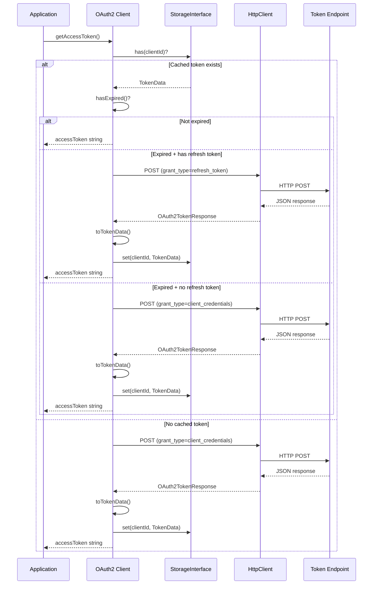
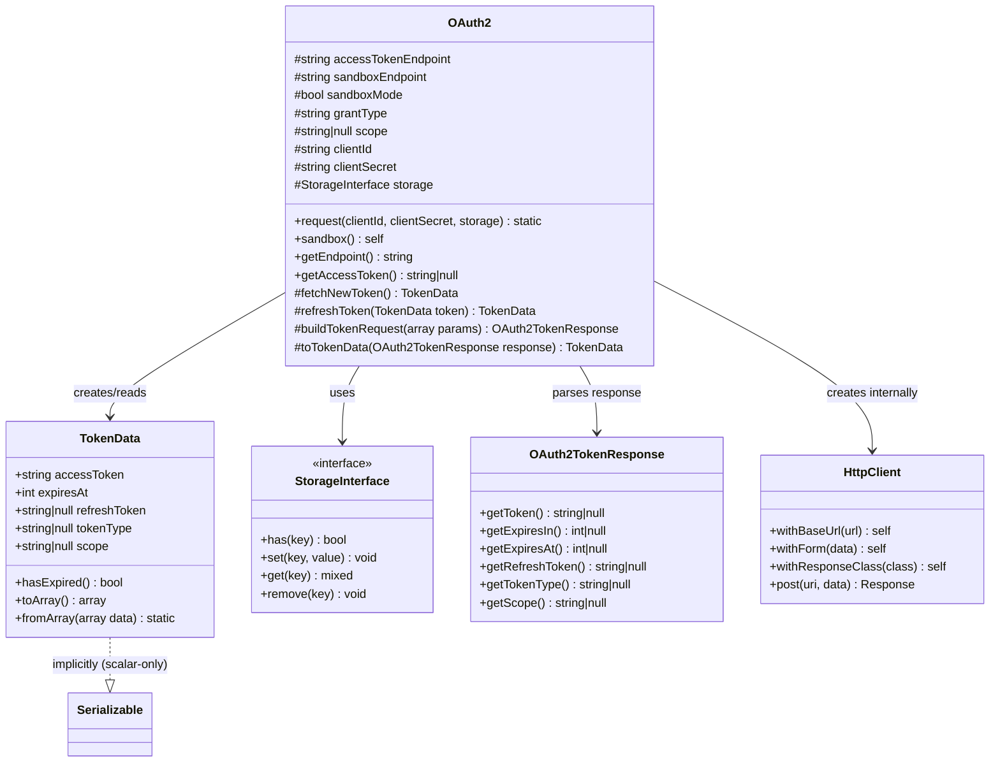
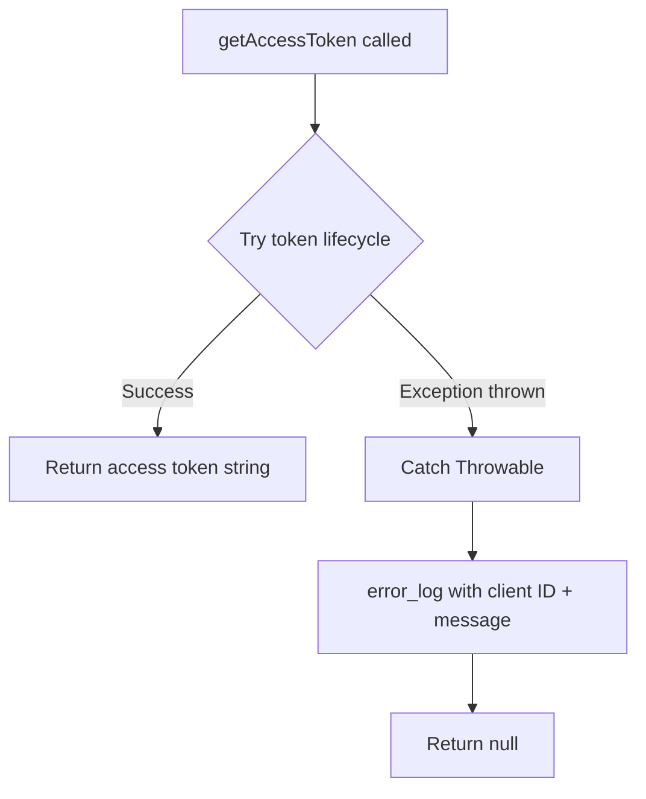

# Design Document: Standalone OAuth2

## Overview

This design refactors the `Simsoft\HttpClient\Clients\OAuth2` class to eliminate
the runtime dependency on `league/oauth2-client`. The refactored class performs
token acquisition, caching, refresh, and expiry detection using only the
library's own `HttpClient` infrastructure — the same approach already proven by
`SimpleOAuth2`.

The key change is replacing the `GenericProvider` from league with direct HTTP
POST calls via `HttpClient`, introducing a new `OAuth2TokenResponse` class for
parsing token endpoint responses, and introducing a serializable `TokenData`
value object to replace the non-serializable `AccessTokenInterface` objects
previously stored in `StorageInterface`.

### Design Goals

- Zero external runtime dependencies for OAuth2 (only `ext-curl`)
- Preserve the existing public API (`request()`, `getAccessToken()`,
  `sandbox()`, `getEndpoint()`)
- Introduce a serializable `TokenData` value object safe for session/cache
  storage
- Support `client_credentials` (default) and `refresh_token` grant types
- Maintain subclass extensibility via protected properties (`$grantType`,
  `$scope`, `$accessTokenEndpoint`, `$sandboxEndpoint`)

## Architecture

### High-Level Flow



### Class Relationships After Refactoring



### Relationship Between OAuth2 and SimpleOAuth2

After refactoring, `OAuth2` and `SimpleOAuth2` serve different use cases but
share the same underlying approach:

| Aspect          | OAuth2 (refactored)                                      | SimpleOAuth2                        |
|-----------------|----------------------------------------------------------|-------------------------------------|
| Inheritance     | Standalone class (no parent)                             | Extends `HttpClient`                |
| Token request   | Internal `HttpClient` instance                           | `$this` (is an HttpClient)          |
| Customization   | Protected properties (`$grantType`, `$scope`, endpoints) | Abstract `postRequest()` method     |
| Token storage   | `TokenData` value object                                 | `SimpleOAuth2Response` directly     |
| Refresh support | Built-in refresh_token grant                             | Not built-in (re-acquires)          |
| Use case        | Standard OAuth2 client_credentials flows                 | Custom/non-standard token endpoints |

`OAuth2` is the recommended class for standard OAuth2 flows. `SimpleOAuth2`
remains for cases where the token endpoint requires non-standard request
formats (custom headers, different body encoding, etc.).

## Components and Interfaces

### 1. OAuth2TokenResponse

**Location:** `src/Clients/Responses/OAuth2TokenResponse.php`

A dedicated response class for parsing OAuth2 token endpoint JSON responses.
Extends the base `Response` class and provides typed accessors for standard
OAuth2 token fields.

```php
<?php

namespace Simsoft\HttpClient\Clients\Responses;

use Simsoft\HttpClient\Response;

/**
 * OAuth2TokenResponse class.
 *
 * Parses standard OAuth2 token endpoint JSON responses, providing typed
 * accessors for access_token, token_type, expires_in, refresh_token, and scope.
 */
class OAuth2TokenResponse extends Response
{
    /**
     * Get the access token string.
     *
     * @return string|null
     */
    public function getToken(): ?string
    {
        return $this->data('access_token');
    }

    /**
     * Get the token type (typically "Bearer").
     *
     * @return string|null
     */
    public function getTokenType(): ?string
    {
        return $this->data('token_type');
    }

    /**
     * Get the token lifetime in seconds.
     *
     * @return int|null
     */
    public function getExpiresIn(): ?int
    {
        $val = $this->data('expires_in');
        return $val !== null ? (int) $val : null;
    }

    /**
     * Get the absolute expiry timestamp (computed from expires_in).
     *
     * @return int|null
     */
    public function getExpiresAt(): ?int
    {
        $expiresIn = $this->getExpiresIn();
        return $expiresIn !== null ? time() + $expiresIn : null;
    }

    /**
     * Get the refresh token string.
     *
     * @return string|null
     */
    public function getRefreshToken(): ?string
    {
        return $this->data('refresh_token');
    }

    /**
     * Get the granted scope string.
     *
     * @return string|null
     */
    public function getScope(): ?string
    {
        return $this->data('scope');
    }
}
```

### 2. TokenData Value Object

**Location:** `src/Clients/TokenData.php`

A plain, serializable value object holding all token fields. Contains only
scalar and nullable-scalar properties — safe for `$_SESSION`, Redis, database,
or any serialization backend.

```php
<?php

namespace Simsoft\HttpClient\Clients;

/**
 * TokenData class.
 *
 * Serializable value object representing an OAuth2 access token and its metadata.
 * Contains only scalar properties to ensure safe persistence in sessions, caches,
 * and databases.
 */
final class TokenData
{
    public function __construct(
        public readonly string  $accessToken,
        public readonly int     $expiresAt,
        public readonly ?string $refreshToken = null,
        public readonly ?string $tokenType = null,
        public readonly ?string $scope = null,
    ) {}

    /**
     * Determine whether this token has expired.
     *
     * @return bool
     */
    public function hasExpired(): bool
    {
        return time() >= $this->expiresAt;
    }

    /**
     * Convert to a plain array for storage backends that prefer arrays.
     *
     * @return array<string, mixed>
     */
    public function toArray(): array
    {
        return [
            'access_token'  => $this->accessToken,
            'expires_at'    => $this->expiresAt,
            'refresh_token' => $this->refreshToken,
            'token_type'    => $this->tokenType,
            'scope'         => $this->scope,
        ];
    }

    /**
     * Reconstruct a TokenData from a plain array.
     *
     * @param array<string, mixed> $data
     * @return static
     */
    public static function fromArray(array $data): static
    {
        return new static(
            accessToken:  (string)($data['access_token'] ?? ''),
            expiresAt:    (int)($data['expires_at'] ?? 0),
            refreshToken: isset($data['refresh_token']) ? (string)$data['refresh_token'] : null,
            tokenType:    isset($data['token_type']) ? (string)$data['token_type'] : null,
            scope:        isset($data['scope']) ? (string)$data['scope'] : null,
        );
    }
}
```

### 3. Refactored OAuth2 Class

**Location:** `src/Clients/OAuth2.php` (same file, rewritten)

Key changes from the current implementation:

- Removes all `League\OAuth2\Client` imports
- Removes `$provider` property and `getProvider()` method
- Removes `refreshToken(AccessTokenInterface $token)` public method
- Adds internal `HttpClient` usage for token requests
- Uses new `OAuth2TokenResponse` for parsing token responses
- Stores `TokenData` instead of `AccessTokenInterface`

```php
<?php

namespace Simsoft\HttpClient\Clients;

use Simsoft\HttpClient\Clients\Helpers\SessionStorage;
use Simsoft\HttpClient\Clients\Responses\OAuth2TokenResponse;
use Simsoft\HttpClient\HttpClient;
use Simsoft\HttpClient\Interfaces\StorageInterface;
use Throwable;

class OAuth2
{
    protected string $accessTokenEndpoint = '';
    protected string $sandboxEndpoint = '';
    protected bool $sandboxMode = false;
    protected string $grantType = 'client_credentials';
    protected ?string $scope = null;
    protected string $tokenStorageName = 'oauth_token';
    protected StorageInterface $storage;

    final public function __construct(
        protected string  $clientId,
        protected string  $clientSecret,
        ?StorageInterface $storage = null,
    ) {
        $this->storage = $storage ?? new SessionStorage($this->tokenStorageName);
    }

    public static function request(
        string            $clientId,
        string            $clientSecret,
        ?StorageInterface $storage = null,
    ): static {
        return new static($clientId, $clientSecret, $storage);
    }

    public function sandbox(): self
    {
        $this->sandboxMode = true;
        return $this;
    }

    public function getEndpoint(): string
    {
        return $this->sandboxMode
            ? $this->sandboxEndpoint
            : $this->accessTokenEndpoint;
    }

    public function getAccessToken(): ?string
    {
        // ... token lifecycle logic (see detailed flow below)
    }

    protected function fetchNewToken(): TokenData
    {
        // POST to token endpoint with client_credentials
    }

    protected function refreshToken(TokenData $token): TokenData
    {
        // POST to token endpoint with refresh_token grant
    }

    protected function buildTokenRequest(array $params): OAuth2TokenResponse
    {
        // Internal HttpClient POST request
    }

    protected function toTokenData(OAuth2TokenResponse $response): TokenData
    {
        // Convert response to TokenData value object
    }
}
```

### 4. Internal HttpClient Usage

The `buildTokenRequest()` method creates a fresh `HttpClient` instance for each
token request:

```php
protected function buildTokenRequest(array $params): OAuth2TokenResponse
{
    /** @var OAuth2TokenResponse $response */
    $response = HttpClient::make()
        ->withResponseClass(OAuth2TokenResponse::class)
        ->withForm($params)
        ->post($this->getEndpoint());

    return $response;
}
```

This approach:

- Uses the library's own HTTP infrastructure (no external dependencies)
- Leverages the new `OAuth2TokenResponse` for parsing (typed accessors for
  `access_token`, `expires_in`, etc.)
- Creates a new client per request (stateless, no side effects between calls)

## Data Models

### TokenData Properties

| Property       | Type      | Description                                                        |
|----------------|-----------|--------------------------------------------------------------------|
| `accessToken`  | `string`  | The OAuth2 access token string                                     |
| `expiresAt`    | `int`     | Unix timestamp when the token expires (includes 30s safety buffer) |
| `refreshToken` | `?string` | Refresh token for obtaining new access tokens                      |
| `tokenType`    | `?string` | Token type (typically "Bearer")                                    |
| `scope`        | `?string` | Granted scope string                                               |

### Token Request Parameters

**Client Credentials Grant:**

```
grant_type=client_credentials
client_id={clientId}
client_secret={clientSecret}
scope={scope}  (only if configured)
```

**Refresh Token Grant:**

```
grant_type=refresh_token
client_id={clientId}
client_secret={clientSecret}
refresh_token={storedRefreshToken}
```

### Token Response (from server)

Standard OAuth2 JSON response:

```json
{
    "access_token": "eyJ...",
    "token_type": "Bearer",
    "expires_in": 3600,
    "refresh_token": "def50200...",
    "scope": "read write"
}
```

### Storage Key Strategy

Tokens are stored keyed by `clientId`. This allows multiple OAuth2 subclasses
with different client IDs to coexist in the same storage backend without
collision.

## Correctness Properties

*A property is a characteristic or behavior that should hold true across all
valid executions of a system — essentially, a formal statement about what the
system should do. Properties serve as the bridge between human-readable
specifications and machine-verifiable correctness guarantees.*

### Property 1: TokenData serialization round-trip

*For any* valid `TokenData` instance (with any combination of non-empty
accessToken, any integer expiresAt, and any nullable
refreshToken/tokenType/scope), serializing via `serialize()` then unserializing
via `unserialize()` SHALL produce an object with identical property values.

**Validates: Requirements 8.2**

### Property 2: Token expiry detection correctness

*For any* integer `expiresAt` value, `TokenData::hasExpired()` SHALL return
`true` if and only if the current time (`time()`) is greater than or equal to
`expiresAt`.

**Validates: Requirements 8.3**

### Property 3: Cached non-expired token returned without network call

*For any* `TokenData` instance where `hasExpired()` returns `false`, when that
token is present in storage keyed by the client ID, `getAccessToken()` SHALL
return the `accessToken` string from that `TokenData` without instantiating an
`HttpClient` or making any HTTP request.

**Validates: Requirements 3.1**

### Property 4: Successful acquisition stores TokenData keyed by client ID

*For any* client ID and any successful token endpoint response containing a
valid access_token and expires_in, the value stored in `StorageInterface` SHALL
be a `TokenData` instance stored under the key equal to the client ID.

**Validates: Requirements 3.4, 3.5**

### Property 5: Custom grant type propagates to request body

*For any* non-empty string set as the `$grantType` property in a subclass, when
`fetchNewToken()` is called, the POST body sent to the token endpoint SHALL
contain a `grant_type` parameter with that exact string value.

**Validates: Requirements 6.3**

### Property 6: Exception safety

*For any* `Throwable` thrown during token acquisition (whether from network
failure, invalid response, or any other cause), `getAccessToken()` SHALL return
`null` without propagating the exception to the caller.

**Validates: Requirements 9.2**

## Error Handling

### Strategy

The OAuth2 class follows a **fail-safe** error handling pattern: all exceptions
are caught internally, logged, and converted to a `null` return value. This
prevents authentication failures from crashing the application.

### Error Flow



### Specific Error Scenarios

| Scenario                                           | Behavior                                       |
|----------------------------------------------------|------------------------------------------------|
| Network timeout on token request                   | Log error, return null                         |
| Token endpoint returns 401/403                     | Log HTTP error, return null                    |
| Token endpoint returns 500                         | Log server error, return null                  |
| Malformed JSON response                            | Log parse error, return null                   |
| Refresh token rejected                             | Log refresh failure, attempt fresh acquisition |
| Fresh acquisition also fails after refresh failure | Log second error, return null                  |
| Storage read/write failure                         | Log storage error, return null                 |

### Logging Format

All errors are logged via `error_log()` with a consistent prefix:

```
[OAuth2] Failed to get access token for client "client-id": Exception message here
[OAuth2] Refresh failed for client "client-id": HTTP 401 — attempting fresh token
```

### Refresh Fallback Logic

When a refresh attempt fails, the class does not immediately return null.
Instead:

1. Log the refresh failure
2. Attempt a fresh token acquisition using the configured `$grantType`
3. If the fresh acquisition also fails, log that error and return null

This two-stage fallback ensures that an expired refresh token doesn't
permanently block authentication — the client can recover by obtaining a
completely new token.

## Testing Strategy

### Dual Testing Approach

This feature uses both unit tests and property-based tests for comprehensive
coverage:

- **Property-based tests** (via `steos/quickcheck`): Verify universal
  correctness properties across many generated inputs (minimum 100 iterations
  per property)
- **Unit tests** (via PHPUnit): Verify specific scenarios, integration points,
  error conditions, and API contracts

### Property-Based Testing Configuration

- Library: `steos/quickcheck` ^2.0 (already in dev dependencies)
- Minimum iterations: 100 per property
- Each property test references its design document property
- Tag format: `Feature: standalone-oauth2, Property {number}: {property_text}`

### Test File Structure

```
tests/Clients/
├── OAuth2Test.php                    # Unit tests (rewritten for standalone)
├── OAuth2PropertyTest.php            # Property-based tests
├── TokenDataTest.php                 # Unit tests for TokenData
└── TokenDataPropertyTest.php         # Property-based tests for TokenData
```

### Property Test Coverage

| Property                     | Test Class              | What's Generated                                      |
|------------------------------|-------------------------|-------------------------------------------------------|
| 1: Serialization round-trip  | `TokenDataPropertyTest` | Random TokenData instances (strings, ints, nullables) |
| 2: Expiry detection          | `TokenDataPropertyTest` | Random integer timestamps                             |
| 3: Cached token return       | `OAuth2PropertyTest`    | Random TokenData with future expiresAt                |
| 4: Storage after acquisition | `OAuth2PropertyTest`    | Random client IDs + mock responses                    |
| 5: Grant type propagation    | `OAuth2PropertyTest`    | Random non-empty strings as grant types               |
| 6: Exception safety          | `OAuth2PropertyTest`    | Random exception types and messages                   |

### Unit Test Coverage

| Scenario                                          | Test Class      |
|---------------------------------------------------|-----------------|
| Factory method returns correct instance           | `OAuth2Test`    |
| Sandbox switches endpoint                         | `OAuth2Test`    |
| Default grant type and scope                      | `OAuth2Test`    |
| Scope included in request when configured         | `OAuth2Test`    |
| Expired token with refresh token triggers refresh | `OAuth2Test`    |
| Expired token without refresh token fetches new   | `OAuth2Test`    |
| Refresh failure falls back to fresh acquisition   | `OAuth2Test`    |
| Non-2xx response returns null                     | `OAuth2Test`    |
| TokenData construction and accessors              | `TokenDataTest` |
| TokenData::fromArray with missing fields          | `TokenDataTest` |
| TokenData::toArray produces expected structure    | `TokenDataTest` |

### Mocking Strategy

- `StorageInterface` is mocked via PHPUnit mock objects
- `HttpClient` behavior is tested by extracting `buildTokenRequest()` as a
  protected method that can be overridden in test subclasses
- No real HTTP calls are made in any test
- `error_log()` output is captured via `@` operator or custom error handler in
  tests

### Migration Testing

- Verify `OAuth2` class exists in `Simsoft\HttpClient\Clients` namespace
- Verify `getProvider()` method no longer exists
- Verify no `League\OAuth2\Client` imports in `src/Clients/OAuth2.php`
- Verify `composer.json` has `league/oauth2-client` under `suggest` (not
  `require`)
