# Design Document

## Overview

This design covers comprehensive unit testing and code quality enforcement for
the `simsoft/http-client` PHP library. The test suite will use PHPUnit 11 with
test doubles (mocks/stubs) to isolate units from cURL and network dependencies.
All tests will be structured to run without external HTTP calls, using
reflection where needed to verify internal state, and mock objects for interface
contracts.

The approach prioritizes testability of pure logic (stream operations, data
parsing, URL composition, retry decisions) while using mocks for I/O-bound
components (cURL execution, session storage, OAuth2 providers).

## Architecture

```mermaid
graph TD
    subgraph TestSuite["PHPUnit Test Suite"]
        ST["StringStreamTest"]
        FT["FileStreamTest"]
        RT["ResponseTest"]
        HT["HttpClientTest"]
        MT["MacroableTest"]
        CT["CurlOptionsTest"]
        ET["ExceptionTest"]
        OT["OAuth2Test"]
        SO["SimpleOAuth2Test"]
        SS["SessionStorageTest"]
        DT["DeprecatedTraitTest"]
        SB["SandboxTraitTest"]
        RY["RetryTraitTest"]
        MW["MiddlewareTest"]
    end

    subgraph Fixtures["JSON Fixtures"]
        UF["user.json"]
        TF["oauth2-token.json"]
        RF["responses.json"]
    end

    subgraph Source["Source Under Test"]
        StringStream
        FileStream
        Response
        HttpClient
        Macroable
        CurlOptionsTrait
        Exceptions
        OAuth2
        SimpleOAuth2
        SessionStorage
        DeprecatedTrait
        Sandbox
        RetryTrait
    end

    ST --> StringStream
    FT --> FileStream
    RT --> Response
    RT --> UF
    RT --> RF
    HT --> HttpClient
    MT --> Macroable
    CT --> CurlOptionsTrait
    ET --> Exceptions
    OT --> OAuth2
    OT --> TF
    SO --> SimpleOAuth2
    SO --> TF
    SS --> SessionStorage
    DT --> DeprecatedTrait
    SB --> Sandbox
    RY --> RetryTrait
    MW --> HttpClient
```



### Test Isolation Strategy

- **Stream classes**: Tested directly — pure in-memory (StringStream) or
  file-based (FileStream) with temp files.
- **Response class**: Constructed directly with raw body/headers/curlInfo — no
  cURL needed.
- **HttpClient**: Use reflection to inspect internal state after fluent method
  calls. Middleware tests use a testable subclass that exposes the pipeline.
- **Traits**: Tested via concrete host classes or anonymous classes that `use`
  the trait.
- **OAuth2 clients**: Mock `StorageInterface` and `GenericProvider` to isolate
  token lifecycle logic.
- **Exceptions**: Direct construction and interface verification.

## Components and Interfaces

### Test Classes

| Test Class                 | Source Under Test                        | Strategy                                                      |
|----------------------------|------------------------------------------|---------------------------------------------------------------|
| `StringStreamTest`         | `Streams\StringStream`                   | Direct construction, property-based tests for read/write/seek |
| `FileStreamTest`           | `Streams\FileStream`                     | Temp file fixtures, direct construction                       |
| `ResponseTest`             | `Response`                               | Direct construction with raw params, JSON fixtures            |
| `HttpClientTest`           | `HttpClient`                             | Reflection for internal state, mock streams                   |
| `MacroableTraitTest`       | `Traits\Macroable`                       | Anonymous class host, closure registration                    |
| `CurlOptionsTraitTest`     | `Traits\CurlOptionsTrait`                | Anonymous class host, reflection                              |
| `ExceptionTest`            | `Exceptions\*`                           | Direct construction, interface checks                         |
| `OAuth2Test`               | `Clients\OAuth2`                         | Mock StorageInterface + GenericProvider                       |
| `SimpleOAuth2Test`         | `Clients\SimpleOAuth2`                   | Concrete test subclass, mock storage                          |
| `SimpleOAuth2ResponseTest` | `Clients\Responses\SimpleOAuth2Response` | Direct construction with token JSON                           |
| `SessionStorageTest`       | `Clients\Helpers\SessionStorage`         | Simulated $_SESSION superglobal                               |
| `DeprecatedTraitTest`      | `Traits\DeprecatedTrait`                 | set_error_handler to capture E_USER_DEPRECATED                |
| `SandboxTraitTest`         | `Traits\Sandbox`                         | Anonymous class host                                          |
| `RetryTraitTest`           | `Traits\RetryTrait`                      | Anonymous class host, mock Response                           |
| `MiddlewareTest`           | `HttpClient` middleware pipeline         | Testable subclass exposing pipeline                           |

### JSON Fixture Files

- `tests/fixtures/user.json` — Existing user records (copy of current
  `tests/user.json`)
- `tests/fixtures/oauth2-token.json` — OAuth2 token response with access_token,
  expires_in, refresh_token, token_type, scope
- `tests/fixtures/responses.json` — HTTP response scenarios: success (200), not
  found (404), server error (500), empty body, redirect headers

## Data Models

### Test Fixture: OAuth2 Token Response

```json
{
    "access_token": "eyJ0eXAiOiJKV1QiLCJhbGciOiJSUzI1NiJ9.test",
    "token_type": "Bearer",
    "expires_in": 3600,
    "refresh_token": "def50200abc123refresh",
    "scope": "read write"
}
```

### Test Fixture: HTTP Response Scenarios

```json
{
    "success": {
        "status": 200,
        "body": "{\"message\": \"OK\"}",
        "headers": "HTTP/1.1 200 OK\r\nContent-Type: application/json\r\n"
    },
    "not_found": {
        "status": 404,
        "body": "{\"error\": \"Not Found\"}",
        "headers": "HTTP/1.1 404 Not Found\r\nContent-Type: application/json\r\n"
    },
    "server_error": {
        "status": 500,
        "body": "{\"error\": \"Internal Server Error\"}",
        "headers": "HTTP/1.1 500 Internal Server Error\r\n"
    },
    "empty_body": {
        "status": 204,
        "body": "",
        "headers": "HTTP/1.1 204 No Content\r\n"
    },
    "redirect_chain": {
        "status": 200,
        "body": "{\"redirected\": true}",
        "headers": "HTTP/1.1 301 Moved\r\nLocation: /new\r\n\r\nHTTP/1.1 200 OK\r\nContent-Type: application/json\r\n"
    }
}
```

## Correctness Properties

*A property is a characteristic or behavior that should hold true across all
valid executions of a system — essentially, a formal statement about what the
system should do. Properties serve as the bridge between human-readable
specifications and machine-verifiable correctness guarantees.*

### Property 1: StringStream write/read round-trip

*For any* valid string content, creating an empty StringStream, writing the
content, rewinding to position zero, and reading the full length SHALL produce
the original content.

**Validates: Requirements 1.10**

### Property 2: StringStream read returns correct substring

*For any* StringStream with non-empty content and any valid read length (1 to
content length), calling read() SHALL return a substring matching
`substr(content, position, length)` and advance the position by the length of
the returned string.

**Validates: Requirements 1.2**

### Property 3: StringStream seek positions correctly

*For any* StringStream with content of length N and any valid offset, seek(
offset, SEEK_SET) SHALL set position to offset, seek(offset, SEEK_CUR) SHALL set
position to current + offset, and seek(offset, SEEK_END) SHALL set position to
N + offset, provided the resulting position is non-negative.

**Validates: Requirements 1.4**

### Property 4: StringStream write at position splices content correctly

*For any* StringStream with initial content, after seeking to a valid position
and writing a string, the resulting content SHALL equal the original content
with the written string replacing bytes starting at that position, and getSize()
SHALL return the new content length.

**Validates: Requirements 1.3**

### Property 5: Response status code maps to correct helpers

*For any* HTTP status code in range 100–599, constructing a Response with that
code SHALL cause exactly the matching status helper methods to return true: ok()
for 200, created() for 201, notFound() for 404, successful() for 200–299,
isClientError() for 400–499, isServerError() for 500+, isRedirect() for 300–399,
and failed() for 400+ or network errors.

**Validates: Requirements 3.1, 3.7**

## Error Handling

### Test Error Scenarios

| Component        | Error Condition                        | Expected Behavior                |
|------------------|----------------------------------------|----------------------------------|
| StringStream     | read/write/seek after close()          | RuntimeException                 |
| StringStream     | seek to negative position              | RuntimeException                 |
| FileStream       | Non-existent file path                 | RuntimeException on first access |
| FileStream       | write() call                           | RuntimeException (read-only)     |
| Response         | Invalid JSON body                      | RuntimeException from json()     |
| HttpClient       | withJson() with non-encodable data     | InvalidArgumentException         |
| HttpClient       | withResponseClass() with invalid class | InvalidArgumentException         |
| HttpClient       | retry(0)                               | InvalidArgumentException         |
| Macroable        | Call undefined macro                   | BadMethodCallException           |
| CurlOptionsTrait | Negative timeout                       | InvalidArgumentException         |
| OAuth2           | refreshToken() without refresh token   | InvalidArgumentException         |
| OAuth2           | Token acquisition failure              | getAccessToken() returns null    |
| SimpleOAuth2     | postRequest() returns error            | getAccessToken() returns null    |

### Test Assertions for Exceptions

All exception tests will use PHPUnit's `expectException()` and
`expectExceptionMessage()` to verify:

1. Correct exception class is thrown
2. Exception message contains meaningful context
3. Previous exception chain is preserved where applicable

## Testing Strategy

### Framework and Tools

- **PHPUnit 11** — Test runner with attributes (`#[Test]`, `#[DataProvider]`)
- **PHPUnit Mocks** — `createMock()` / `createStub()` for interfaces (
  StorageInterface, StreamInterface, RequestInterface, GenericProvider)
- **Reflection** — `ReflectionProperty` to inspect protected/private state on
  HttpClient and trait hosts
- **phpqc/phpquickcheck** — Property-based testing library for PHP

### Property-Based Testing

Property-based tests will use `phpqc/phpquickcheck` with minimum 100 iterations
per property. Each property test references its design document property.

Tag format: **Feature: unit-tests-and-code-quality, Property {number}:
{property_text}**

Properties to implement:

1. StringStream write/read round-trip (Property 1)
2. StringStream read correctness (Property 2)
3. StringStream seek correctness (Property 3)
4. StringStream write splice correctness (Property 4)
5. Response status code helper mapping (Property 5)

### Unit Testing

Example-based unit tests cover all remaining acceptance criteria:

- Stream construction, close/detach, eof, getSize, __toString
- FileStream read, seek, write rejection, non-existent file
- Response JSON decoding, dot-notation, wildcards, PSR-7 immutability, header
  parsing
- HttpClient fluent API, URL composition, content types, middleware, retry
- Macroable registration, mixin, $this binding
- CurlOptionsTrait timeouts, SSL, buffer, verbose
- Exception interface compliance and context preservation
- OAuth2/SimpleOAuth2 token lifecycle with mocked dependencies
- SessionStorage CRUD operations
- DeprecatedTrait deprecation notices
- Sandbox endpoint switching
- Retry logic conditions and callbacks

### Test Directory Structure

```
tests/
├── fixtures/
│   ├── user.json
│   ├── oauth2-token.json
│   └── responses.json
├── Streams/
│   ├── StringStreamTest.php
│   └── FileStreamTest.php
├── ResponseTest.php
├── HttpClientTest.php
├── Traits/
│   ├── MacroableTraitTest.php
│   ├── CurlOptionsTraitTest.php
│   ├── DeprecatedTraitTest.php
│   ├── SandboxTraitTest.php
│   └── RetryTraitTest.php
├── Exceptions/
│   └── ExceptionTest.php
├── Clients/
│   ├── OAuth2Test.php
│   ├── SimpleOAuth2Test.php
│   ├── SimpleOAuth2ResponseTest.php
│   └── SessionStorageTest.php
└── MiddlewareTest.php
```

### Code Quality Enforcement

- **PHPMD**: All test files must pass `phpmd.xml` ruleset (CamelCase naming, min
  2-char variables, no unused code)
- **PHPStan Level 8**: All test files must pass with zero errors, full PHPDoc
  annotations, `declare(strict_types=1)`
- **PSR-12**: Code style compliance via PHP_CodeSniffer

### PHPStan Configuration Update

The `phpstan.neon` paths array should be extended to include `tests/` for static
analysis of test code.
